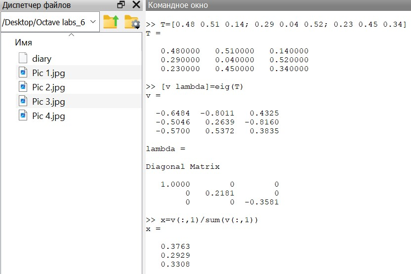
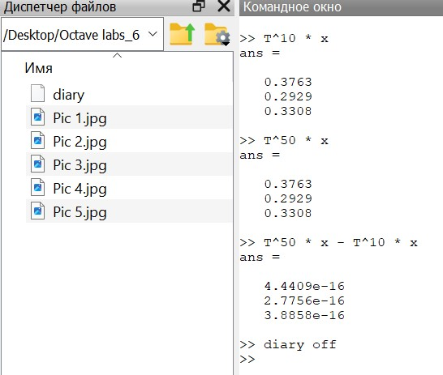

---
## Front matter
lang: ru-RU
title: Лабораторная работа №8
subtitle: Научное программирование
author:
  - Таубер Кирилл Олегович
institute:
  - Российский университет дружбы народов
  - Москва, Россия
date: 3 февраля 2024

## i18n babel
babel-lang: russian
babel-otherlangs: english

## Formatting
mainfont: PT Serif
romanfont: PT Serif
sansfont: PT Sans
monofont: PT Mono
toc: false
slide_level: 2
theme: metropolis
header-includes: 
 - \metroset{progressbar=frametitle,sectionpage=progressbar,numbering=fraction}
 - '\makeatletter'
 - '\beamer@ignorenonframefalse'
 - '\makeatother'
aspectratio: 43
section-titles: true
---

## Цель лабораторной работы

Изучить в Octave методы работы с собственными значениями и собственными векторами, а также с марковскими цепями (случайное блуждание)

## Теоретическое введение

Ненулевой вектор $\vec{u}$, который при умножении на некоторую квадратную матрицу $A$ превращается в самого же себя с числовым коэффициентом $\lambda$, называется __собственным вектором__ матрицы $A$. Число $\lambda$ называется __собственным значением__ или __собственным числом__ данной матрицы.

## Теоретическое введение

Система называется __цепью Маркова__, если последовательность случайных событий удовлетворяет следующим условиям: 

* возможно конечное число состояний,
 
* через определенные промежутки времени проводится наблюдение и регистрируется состояние системы,

* для каждого состояния задается вероятность перехода в каждое из остальных состояний или вероятность остаться в том же самом состоянии. Существенным предположением является то, что эти вероятности зависят только от текущего состояния.

## Ход выполнения лабораторной работы
- Нашли собственные значения и собственные векторы заданной матрицы

{ #fig:001 width=70% }

## Ход выполнения лабораторной работы
- Получили матрицу с действительными собственными значениями, создав симметричную матрицу путем умножения матрицы $A$ на транспонированную матрицу $A$

{ #fig:002 width=55% }

## Ход выполнения лабораторной работы
- Для примера случайного блуждания нашли вектор вероятности после 5 шагов для каждого из заданных начальных векторов вероятности

{ #fig:003 width=70% }

## Ход выполнения лабораторной работы

- Нашли вектор равновесного состояния для цепи Маркова с заданной переходной матрицей 

{ #fig:005 width=60% }

## Ход выполнения лабораторной работы
- Проверили правильность полученного результата

{ #fig:006 width=50% }

## Вывод
- В ходе выполнения данной лабораторной работы я изучил в Octave методы работы с собственными значениями и собственными векторами, а также с марковскими цепями (случайное блуждание)
