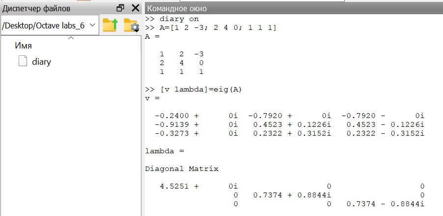
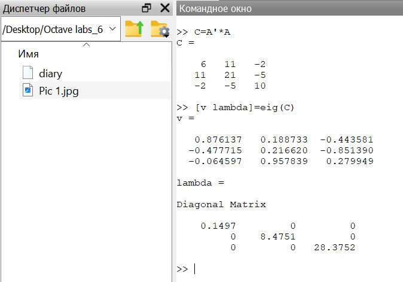
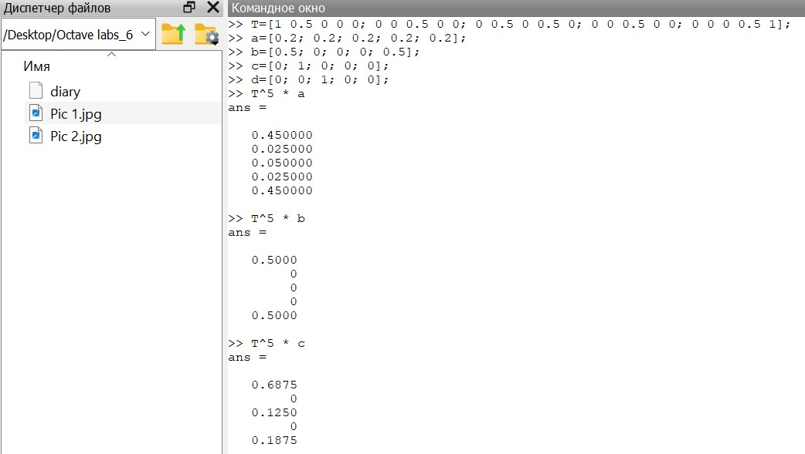
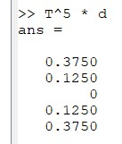
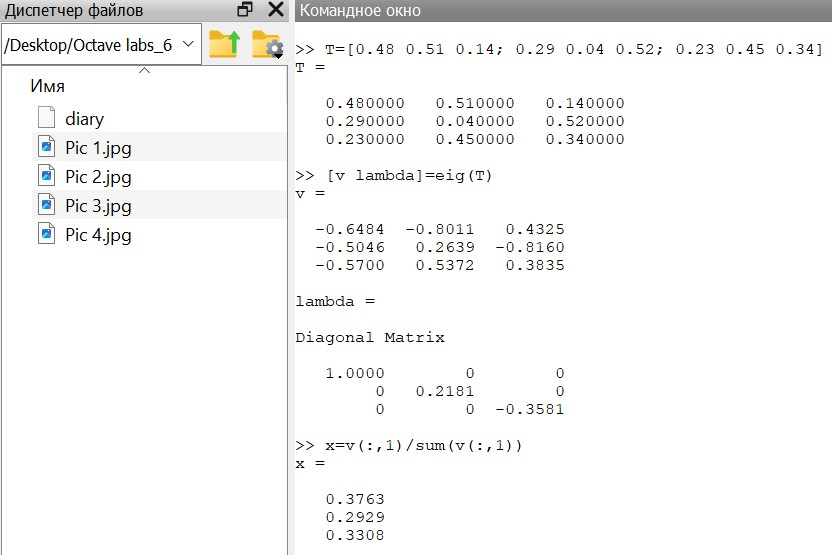
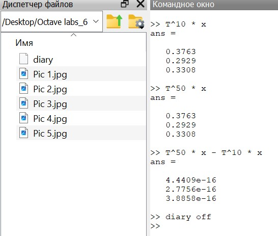

---
## Front matter
title: "Лабораторная работа №8"
subtitle: "Научное программирование"
author: "Таубер Кирилл Олегович"

## Generic otions
lang: ru-RU
toc-title: "Содержание"

## Bibliography
bibliography: bib/cite.bib
csl: pandoc/csl/gost-r-7-0-5-2008-numeric.csl

## Pdf output format
toc: true # Table of contents
toc-depth: 2
lof: true # List of figures
fontsize: 12pt
linestretch: 1.5
papersize: a4
documentclass: scrreprt
## I18n polyglossia
polyglossia-lang:
  name: russian
  options:
	- spelling=modern
	- babelshorthands=true
polyglossia-otherlangs:
  name: english
## I18n babel
babel-lang: russian
babel-otherlangs: english
## Fonts
mainfont: PT Serif
romanfont: PT Serif
sansfont: PT Sans
monofont: PT Mono
mainfontoptions: Ligatures=TeX
romanfontoptions: Ligatures=TeX
sansfontoptions: Ligatures=TeX,Scale=MatchLowercase
monofontoptions: Scale=MatchLowercase,Scale=0.9
## Biblatex
biblatex: true
biblio-style: "gost-numeric"
biblatexoptions:
  - parentracker=true
  - backend=biber
  - hyperref=auto
  - language=auto
  - autolang=other*
  - citestyle=gost-numeric
## Pandoc-crossref LaTeX customization
figureTitle: "Рис."
tableTitle: "Таблица"
listingTitle: "Листинг"
lofTitle: "Список иллюстраций"
lolTitle: "Листинги"
## Misc options
indent: true
header-includes:
  - \usepackage{indentfirst}
  - \usepackage{float} # keep figures where there are in the text
  - \floatplacement{figure}{H} # keep figures where there are in the text
---

# Цель работы

Изучить в Octave методы работы с собственными значениями и собственными векторами, а также с марковскими цепями (случайное блуждание).

# Теоретическое введение

Ненулевой вектор $\vec{u}$, который при умножении на некоторую квадратную матрицу $A$ превращается в самого же себя с числовым коэфиициентом $\lambda$, называется __собственным вектором__ матрицы $A$. Число $\lambda$ называется __собственным значением__ или __собственным числом__ данной матрицы.

Система называется __цепью Маркова__, если последовательность случайных событий удовлетворяет следующим условиям: 

* возможно конечное число состояний,
 
* через определенные промежутки времени проводится наблюдение и регистрируется состояние системы,

* для каждого состояния задается вероятность перехода в каждое из остальных состояний или вероятность остаться в том же самом состоянии. Существенным предположением является то, что эти вероятности зависят только от текущего состояния.

Для любого начального вектора вероятности $x$ и любого положительного целого числа $k$ вектор вероятности после $k$ периодов времени равен $\vec{y} = T^k \vec{x}$.

Состояние $x$ называется __равновесным__, если $\vec{x} = T \vec{x}$, где $T$ - матрица перехода для цепи Маркова. Равновесное состояние не приводит к изменению состояния в будущем. Каждая цепь Маркова имеет хотя бы одно равновесное состояние.

Пусть $T$ - матрица переходов для цепи Маркова. Тогда $\lambda=1$ является собственным значением $T$. Если $x$ является собственным вектором для $\lambda=1$ с неотрицательными компонентами, сумма которых равна $1$, то $x$ является равновесным состоянием для $T$.

Более подробно см. в [@Octave_1:bash] и [@Octave_2:bash].

# Выполнение лабораторной работы

Найдем собственные значения и собственные векторы заданной матрицы (рис. @fig:001).

{#fig:001 width=110%}

Получим матрицу с действительными собственными значениями, создав симметричную матрицу путем умножения матрицы $A$ на транспонированную матрицу $A$ (рис. @fig:002).

{#fig:002 width=110%}

Допустим, что мы случайным образом передвигаемся следующим образом. В состояниях 2, 3 или 4 мы перемещаемся влево или вправо наугад. При достижении конца дороги (состояния 1 или 5) мы останавливаемся. Наша цель - предсказать, где мы окажемся. Для примера случайного блуждания находим вектор вероятности после 5 шагов для каждого из заданных начальных векторов вероятности. Сначала сформируем матрицу переходов. Вероятности будущего состояния вычисляются как $T^k \vec{x}$, где $\vec{x}$ - начальный вектор вероятностей (рис. @fig:003) и (рис. @fig:004).

{#fig:003 width=110%}

{#fig:004 width=15%}

Найдем вектор равновесного состояния для цепи Маркова с заданной переходной матрицей (рис. @fig:005).

{#fig:005 width=110%}

Проверим правильность полученного результата (рис. @fig:006).

{#fig:006 width=80%}

# Вывод 

В ходе выполнения данной лабораторной работы я изучил в Octave методы работы с собственными значениями и собственными векторами, а также с марковскими цепями (случайное блуждание).
